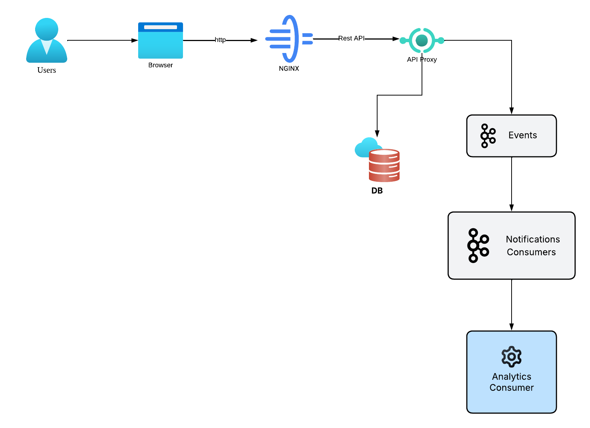

# Product Management

---

## Architecture of the application.

Following points considered when implementation.

* Microservice Architecture.
* Single Data Base for each Service.
* Event Driven Architecture (EDA) for communicate each services.
* Distributed (Each service runs on its own — on separate machines, containers, or node)



## pre-requisite
* Docker installed
* NodeJS installed

## Build and Run

### Back-End

* First run back-end app with kafka and PostgresDB in local. Go to the `/backend` folder then open terminal and run following command

``docker-compose up --build``

### Front-End

* Then run front-end  in local. Go to the `/frontend` folder then open terminal and run following command.

``docker-compose up --build``

## App Access

* Frontend: http://localhost:3000/
* Backend: http://localhost:8080/

## DB

* Database details under `/src/db` folder

## APIs

### Create Product

**POST** `/products`

Create a new product entry.

Request Body

```
{
    "name": "Wireless Mouse",
    "description": "Ergonomic Bluetooth mouse with adjustable DPI",
    "price": 25.99,
    "quantity": 10,
    "category": "electronics",
    "seller_id": "seller-123"
}
```

Example cURL

```
curl -X POST http://localhost:8080/products \
-H "Content-Type: application/json" \
-d '{
"name": "Wireless Mouse",
"description": "Ergonomic Bluetooth mouse with adjustable DPI",
"price": 25.99,
"quantity": 10,
"category": "electronics",
"seller_id": "seller-123"
}'
```

### Get All Products

**GET** `/products?sellerId={seller_id}`

Fetch all products for a specific seller.

Example cURL

```curl http://localhost:8080/products?sellerId=seller-123```

### Update Product

**PUT** `/products/{id}`

Update product details (quantity, price, etc.)

Request Body

```
{
  "name": "Wireless Mouse Pro",
  "price": 29.99,
  "quantity": 3
}
```

Example cURL

```
curl -X PUT http://localhost:8080/products/b2a89e0a-1843-4c4e-b1aa-024b271b41cc \
  -H "Content-Type: application/json" \
  -d '{"name":"Wireless Mouse Pro","price":29.99,"quantity":3}'
```

### Delete Product

**DELETE** `/products/{id}`

Example cURL

```curl -X DELETE http://localhost:8080/products/b2a89e0a-1843-4c4e-b1aa-024b271b41cc```

### Event Listener

**GET** `/events/stream?sellerId={sellerID}`

Example cURL

```curl http://localhost:8080/events/stream?sellerId=seller-124```
